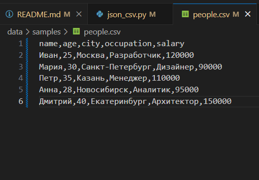
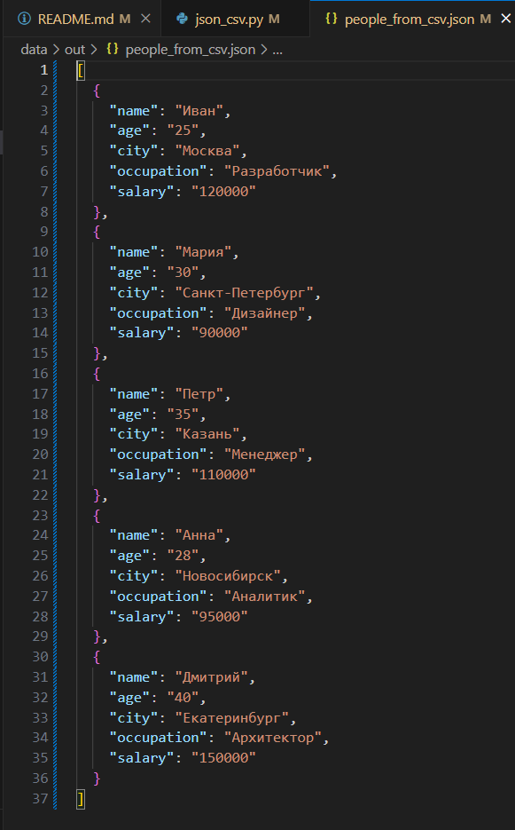
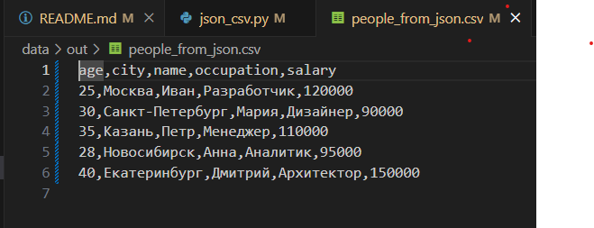
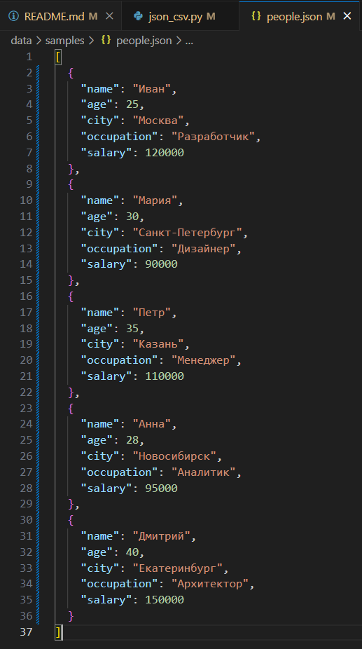
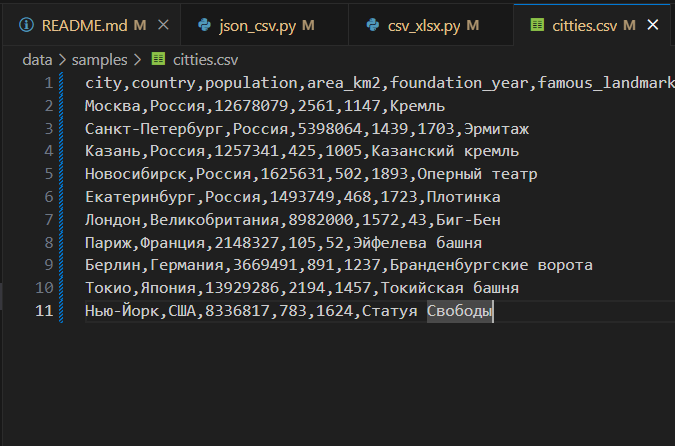
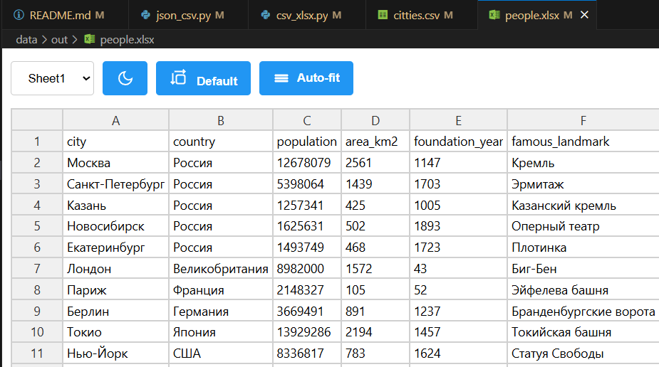

# python_labs
## Лабораторная работа 1

### Задание 1
```python
name = input('Введите ваше имя: ')
age = int(input('Введите ваш возраст:'))
print(f"Привет, {name}! Через год тебе будет {age+1}")
```


### Задание 2
```python
a = input()
a2 = float(a.replace(',','.'))
b = input()
b2 = float(a.replace(',','.'))
print(f'sum={a2+b2:.2f}; avg={((a2+b2)/2):.2f}')
```


### Задание 3
```python
price = float(input())
discont = float(input())
vat = float(input())
base = price * (1 - (discont/100))
vat_amount = base * (vat/100)
total = base + vat_amount
print(f'База после скидки: {base:.2f}₽ \n НДС: {vat_amount:.2f}₽ \n Итого к оплате: {total:.2f}₽')
```


### Задание 4
```python
m = int(input())
print(f'{m//60}:{m%60}')
```


### Задание 5
```python
name = input()
name2 = name.split()
print(f'Инициалы: {name2[0][0]+name2[1][0]+name2[2][0]}')
print(len(name2[0]) + len(name2[1]) + len(name2[2]) + 2)
```


# python_labs
## Лабораторная работа 2

### Задание 1.1
```python
def min_max(arr):
    if len(arr) == 0:
        raise ValueError
    else:
        k = arr[0]
        k2 = arr[0]
        for i in arr:
            if i > k:
                k = i
            if i < k2:
                k2 = i
        return(k2,k)
```


### Задание 1.2
```python
def unique_sorted(arr):
    if len(arr) == 0:
        return []
    else:
        arr2 = []
        for i in range(len(arr)-1):
            for j in range(i+1,len(arr)):
                if arr[i] > arr[j]:
                    a = arr[i]
                    arr[i] = arr[j]
                    arr[j] = a
        for i in arr:
            if arr.count(i) == 1:
                arr2.append(i)
            elif arr.count(i) != 1:
                arr2.append(i)
        return arr2
```


### Задание 1.3
```python
def flatten(arr):
    arr2 = []
    for i in arr:
        if isinstance(i,(tuple,list)):
            for j in i:
                arr2.append(j)
        else:
            raise TypeError
    return arr2
```


### Задание 2.1
```python
def transpose(arr):
    if len(arr) == 0:
        return []
    else:
        for i in arr:
            if len(i) != len(arr[0]):
                raise ValueError
        arr2 = []
        for i in range(len(arr[0])):
            new = []
            for j in range(len(arr)):
                new.append(arr[j][i])
            arr2.append(new)
        return arr2
```


### Задание 2.2
```python
def row_sums(arr):
    if len(arr) == 0:
        return []
    arr2 = []
    for i in range(len(arr)):
        if len(arr[i]) != len(arr[0]):
            raise ValueError
        else:
            arr2.append(sum(arr[i]))
    return arr2
```


### Задание 2.3
```python
def col_sums(arr):
    if len(arr) == 0:
        return []
    for i in arr:
        if len(i) != len(arr[0]):
            raise ValueError
    a2 = []
    for i in range(len(arr[0])):
        s = 0
        for j in range(len(arr)):
            s += arr[j][i]
        a2.append(s)
    return a2
```


### Задание 3
```python
def f(rec: tuple[str, str, float]) -> str:
    fio, group, gpa = rec
    fio = ' '.join(fio.split()).strip()
    fio2 = fio.split()
    if len(fio2) < 2 or len(group.strip()) == 0 or gpa < 0:
        raise ValueError
    s = ''
    if len(fio2) == 3:
        s = f'{fio2[0].title()} {fio2[1][0].title()}.{fio2[2][0].title()}., '
    else:
        s = f'{fio2[0].title()} {fio2[1][0].title()}., '
    s += f'гр. {group}, '
    s += f'GPA {gpa:.2f}'
    return s

```


# python_labs
## Лабораторная работа 3

### Задание 1.1
```python
def normalize(text: str, *, casefold: bool = True, yo2e: bool = True) -> str:
    if casefold:
        text = text.casefold()
    if yo2e:
        text = text.replace('ё', 'е')
        text = text.replace('Ё', 'Е')
    for i in ["\t", "\n", "\r"]:
        text = text.replace(i, ' ')
    text = ' '.join(text.split()).strip()
    return text

```


### Задание 1.2
```python
def tokenize(text: str) -> list[str]:
    text = normalize(text)
    return findall(r'\w+(?:-\w+)*', text)

```


### Задание 1.3-1.4
```python
def count_freq(tokens: list[str]) -> dict[str, int]:
    a = {}
    for i in tokens:
        a[i] = tokens.count(i)
    return a 

def top_n(freq: dict[str, int], n: int = 5) -> list[tuple[str, int]]:
    items = list(freq.items())
    items = sorted(items, key=lambda l: (-l[1], l[0]))
    return items[:n]
```


### Задание 2
```python
import sys
from text import normalize, tokenize, count_freq, top_n

text = sys.stdin.read()
nt = normalize(text)
t = tokenize(nt)
f = count_freq(t)
top_words = top_n(f, 5)

print(f"Всего слов: {len(t)}")
print(f"Уникальных слов: {len(f)}")
print("Топ-5:")
for word, count in top_words:
    print(f"{word}: {count}")
```

# python_labs
## Лабораторная работа 4

### Задание A
```python
import csv
from pathlib import Path
from typing import Iterable, Sequence

def read_text(path: str | Path, encoding: str = "utf-8") -> str:
    p = Path(path)
    return p.read_text(encoding=encoding)

def write_csv(rows: Iterable[Sequence], path: str | Path,
              header: tuple[str, ...] | None = None) -> None:
    p = Path(path)
    rows = list(rows)
    if rows:
        first_len = len(rows[0])
        if any(len(row) != first_len for row in rows):
            raise ValueError("Все строки должны иметь одинаковую длину")
    with p.open("w", newline="", encoding="utf-8") as f:
        w = csv.writer(f)
        if header is not None:
            w.writerow(header)
        for r in rows:
            w.writerow(r)
```


### Задание B
```python
import sys
sys.path.append(r'C:\git\python_labs\src')  
from lab03.text import normalize, tokenize, top_n, count_freq
from lab04.io_txt_csv import read_text, write_csv

def main():
    input_text = read_text(r'C:\git\python_labs\data\lab04\input.txt')
    tokens = tokenize(normalize(input_text))
    freq = count_freq(tokens)
    top_5 = top_n(freq, 5)
    top_all = top_n(freq)
    
    print(f"Всего слов: {len(tokens)}")
    print(f"Уникальных слов: {len(freq)}")
    print("Топ-5:")
    for word, count in top_5:
        print(f"{word}: {count}")
    
    write_csv(top_all, 
              path = r'data\lab04\report.csv', 
              header = ('word', 'count'))

if __name__ == "__main__":
    main()
```


# python_labs
## Лабораторная работа 5

### Задание A
```python
import csv
import json
import os

def json_to_csv(json_path: str, csv_path: str) -> None: 
    if not os.path.exists(json_path):
        raise FileNotFoundError(f'Файл не найден: {json_path}')
    if os.path.getsize(json_path) == 0:
        raise ValueError('Файл пустой')
    with open(json_path,'r',encoding='utf-8') as json_file:
        json_data = json.load(json_file)
        if not isinstance(json_data,list):
            raise ValueError('Json файл не является списком')
        if not(all(isinstance(x,dict) for x in json_data)):
            raise ValueError('Данные json файла не являются словарями')
        keys = set()
        for items in json_data:
            keys.update(items.keys())
        x = sorted(keys)
        with open(csv_path,'w',newline='',encoding='utf-8') as csv_file:
            writer = csv.DictWriter(csv_file,fieldnames=x)
            writer.writeheader()
            writer.writerows(json_data)

def csv_to_json(csv_path: str, json_path: str) -> None:
    if not os.path.exists(csv_path):
        raise FileNotFoundError(f'Файл не найден: {csv_path}')
    if os.path.getsize(csv_path) == 0:
        raise ValueError('Файл полностью пуст')
    try:
        with open(csv_path,'r',encoding='utf-8') as csv_file:
            csv_data = csv.DictReader(csv_file)

            if not csv_data.fieldnames:
                raise ValueError('В файле нет заголовка')
            
            row_l = list(csv_data)
            if len(row_l) == 0:
                raise ValueError('Файл не содержит никаких данных')
    except Exception as e:
            raise ValueError(f'Ошибка: {e}')
    with open(json_path,'w',encoding='utf-8') as json_file:
        json.dump(row_l,json_file,ensure_ascii=False,indent=2)
```





### Задание B
```python
import os
import csv
from openpyxl import Workbook

def csv_to_xlsx(csv_path: str, xlsx_path: str) -> None:
    if not os.path.exists(csv_path):
        raise FileNotFoundError(f'Файл не найден: {csv_path}')
    if os.path.getsize(csv_path) == 0:
        raise ValueError('Файл полностью пуст')
    
    wb = Workbook()
    ws = wb.active
    ws.title = "Sheet1"

    with open(csv_path, "r", encoding="utf-8") as csv_file: 
        reader = csv.reader(csv_file)
        for row in reader:
            ws.append(row)

    for column_cells in ws.columns:
        max_length = 0
        column_l = column_cells[0].column_letter
        for cell in column_cells:
            if cell.value:
                max_length = max(max_length, len(str(cell.value)))
        ws.column_dimensions[column_l].width = max(max_length + 2, 8)
    wb.save(xlsx_path)
csv_to_xlsx(r"C:\git\python_labs\data\samples\citties.csv",
            r"C:\git\python_labs\data\out\people.xlsx")
```



