 # python_labs
## Лабораторная работа 1

### Задание 1
```python
name = input('Введите ваше имя: ')
age = int(input('Введите ваш возраст:'))
print(f"Привет, {name}! Через год тебе будет {age+1}")
```


### Задание 2
```python
a = input()
a2 = float(a.replace(',','.'))
b = input()
b2 = float(a.replace(',','.'))
print(f'sum={a2+b2:.2f}; avg={((a2+b2)/2):.2f}')
```


### Задание 3
```python
price = float(input())
discont = float(input())
vat = float(input())
base = price * (1 - (discont/100))
vat_amount = base * (vat/100)
total = base + vat_amount
print(f'База после скидки: {base:.2f}₽ \n НДС: {vat_amount:.2f}₽ \n Итого к оплате: {total:.2f}₽')
```


### Задание 4
```python
m = int(input())
print(f'{m//60}:{m%60}')
```


### Задание 5
```python
name = input()
name2 = name.split()
print(f'Инициалы: {name2[0][0]+name2[1][0]+name2[2][0]}')
print(len(name2[0]) + len(name2[1]) + len(name2[2]) + 2)
```


# python_labs
## Лабораторная работа 2

### Задание 1.1
```python
def min_max(arr):
    if len(arr) == 0:
        raise ValueError
    else:
        k = arr[0]
        k2 = arr[0]
        for i in arr:
            if i > k:
                k = i
            if i < k2:
                k2 = i
        return(k2,k)
```


### Задание 1.2
```python
def unique_sorted(arr):
    if len(arr) == 0:
        return []
    else:
        arr2 = []
        for i in range(len(arr)-1):
            for j in range(i+1,len(arr)):
                if arr[i] > arr[j]:
                    a = arr[i]
                    arr[i] = arr[j]
                    arr[j] = a
        for i in arr:
            if arr.count(i) == 1:
                arr2.append(i)
            elif arr.count(i) != 1:
                arr2.append(i)
        return arr2
```
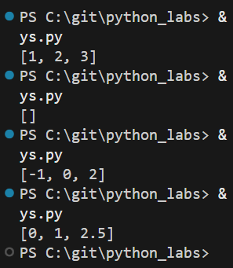

### Задание 1.3
```python
def flatten(arr):
    arr2 = []
    for i in arr:
        if isinstance(i,(tuple,list)):
            for j in i:
                arr2.append(j)
        else:
            raise TypeError
    return arr2
```
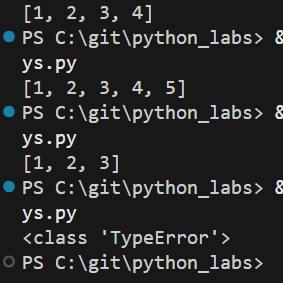

### Задание 2.1
```python
def transpose(arr):
    if len(arr) == 0:
        return []
    else:
        for i in arr:
            if len(i) != len(arr[0]):
                raise ValueError
        arr2 = []
        for i in range(len(arr[0])):
            new = []
            for j in range(len(arr)):
                new.append(arr[j][i])
            arr2.append(new)
        return arr2
```


### Задание 2.2
```python
def row_sums(arr):
    if len(arr) == 0:
        return []
    arr2 = []
    for i in range(len(arr)):
        if len(arr[i]) != len(arr[0]):
            raise ValueError
        else:
            arr2.append(sum(arr[i]))
    return arr2
```
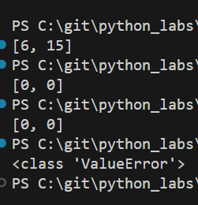

### Задание 2.3
```python
def col_sums(arr):
    if len(arr) == 0:
        return []
    for i in arr:
        if len(i) != len(arr[0]):
            raise ValueError
    a2 = []
    for i in range(len(arr[0])):
        s = 0
        for j in range(len(arr)):
            s += arr[j][i]
        a2.append(s)
    return a2
```
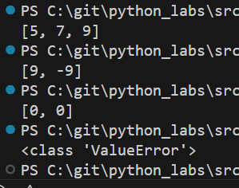

### Задание 3
```python
def f(rec: tuple[str, str, float]) -> str:
    fio, group, gpa = rec
    fio = ' '.join(fio.split()).strip()
    fio2 = fio.split()
    if len(fio2) < 2 or len(group.strip()) == 0 or gpa < 0:
        raise ValueError
    s = ''
    if len(fio2) == 3:
        s = f'{fio2[0].title()} {fio2[1][0].title()}.{fio2[2][0].title()}., '
    else:
        s = f'{fio2[0].title()} {fio2[1][0].title()}., '
    s += f'гр. {group}, '
    s += f'GPA {gpa:.2f}'
    return s

```
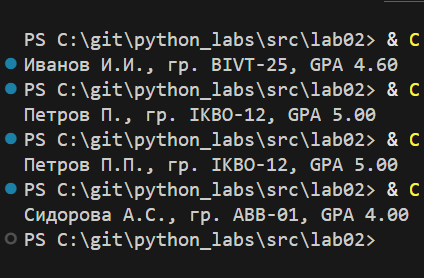

# python_labs
## Лабораторная работа 3

### Задание 1.1
```python
def normalize(text: str, *, casefold: bool = True, yo2e: bool = True) -> str:
    if casefold:
        text = text.casefold()
    if yo2e:
        text = text.replace('ё', 'е')
        text = text.replace('Ё', 'Е')
    for i in ["\t", "\n", "\r"]:
        text = text.replace(i, ' ')
    text = ' '.join(text.split()).strip()
    return text

```
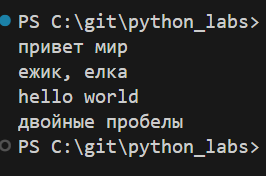

### Задание 1.2
```python
def tokenize(text: str) -> list[str]:
    text = normalize(text)
    return findall(r'\w+(?:-\w+)*', text)

```
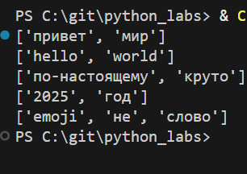

### Задание 1.3-1.4
```python
def count_freq(tokens: list[str]) -> dict[str, int]:
    a = {}
    for i in tokens:
        a[i] = tokens.count(i)
    return a 

def top_n(freq: dict[str, int], n: int = 5) -> list[tuple[str, int]]:
    items = list(freq.items())
    items = sorted(items, key=lambda l: (-l[1], l[0]))
    return items[:n]
```
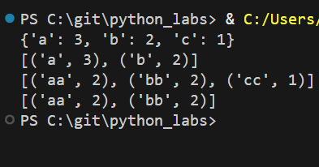

### Задание 2
```python
import sys
from text import normalize, tokenize, count_freq, top_n

text = sys.stdin.read()
nt = normalize(text)
t = tokenize(nt)
f = count_freq(t)
top_words = top_n(f, 5)

print(f"Всего слов: {len(t)}")
print(f"Уникальных слов: {len(f)}")
print("Топ-5:")
for word, count in top_words:
    print(f"{word}: {count}")
```
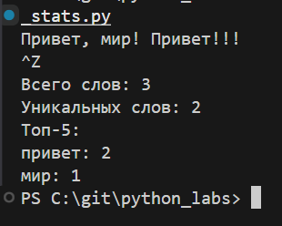
# python_labs
## Лабораторная работа 4

### Задание A
```python
import csv
from pathlib import Path
from typing import Iterable, Sequence

def read_text(path: str | Path, encoding: str = "utf-8") -> str:
    p = Path(path)
    return p.read_text(encoding=encoding)

def write_csv(rows: Iterable[Sequence], path: str | Path,
              header: tuple[str, ...] | None = None) -> None:
    p = Path(path)
    rows = list(rows)
    if rows:
        first_len = len(rows[0])
        if any(len(row) != first_len for row in rows):
            raise ValueError("Все строки должны иметь одинаковую длину")
    with p.open("w", newline="", encoding="utf-8") as f:
        w = csv.writer(f)
        if header is not None:
            w.writerow(header)
        for r in rows:
            w.writerow(r)
```
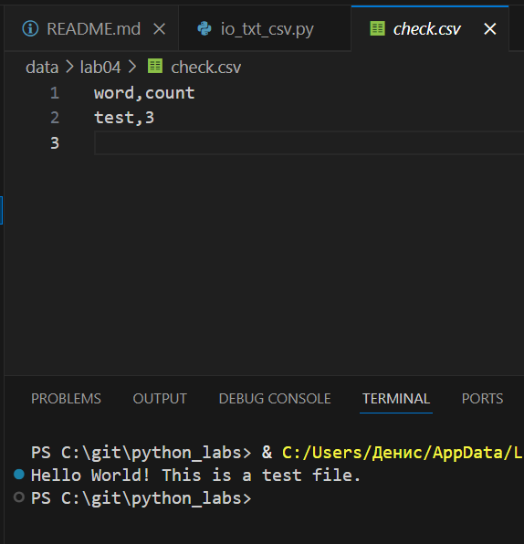

### Задание B
```python
import sys
sys.path.append(r'C:\git\python_labs\src')  
from lab03.text import normalize, tokenize, top_n, count_freq
from lab04.io_txt_csv import read_text, write_csv

def main():
    input_text = read_text(r'C:\git\python_labs\data\lab04\input.txt')
    tokens = tokenize(normalize(input_text))
    freq = count_freq(tokens)
    top_5 = top_n(freq, 5)
    top_all = top_n(freq)
    
    print(f"Всего слов: {len(tokens)}")
    print(f"Уникальных слов: {len(freq)}")
    print("Топ-5:")
    for word, count in top_5:
        print(f"{word}: {count}")
    
    write_csv(top_all, 
              path = r'data\lab04\report.csv', 
              header = ('word', 'count'))

if __name__ == "__main__":
    main()
```
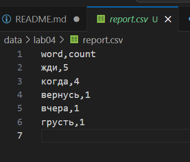
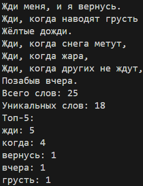

# python_labs
## Лабораторная работа 6
### Задание А
```python
import argparse
import sys
from pathlib import Path

def main():
    parser = argparse.ArgumentParser(description="CLI‑утилиты лабораторной №6")
    subparsers = parser.add_subparsers(dest="command")
    
    cat_parser = subparsers.add_parser("cat", help="Вывести содержимое файла")
    cat_parser.add_argument("--input", required=True)
    cat_parser.add_argument("-n", action="store_true", help="Нумеровать строки")

    stats_parser = subparsers.add_parser("stats", help="Частоты слов")
    stats_parser.add_argument("--input", required=True)
    stats_parser.add_argument("--top", type=int, default=5)

    args = parser.parse_args()

    if args.command == "cat":
        try:
            with open(args.input, 'r', encoding='utf-8') as f:
                for i, line in enumerate(f, 1):
                    if args.n:
                        print(f"{i:4} {line.rstrip()}")
                    else:
                        print(line.rstrip())
        except FileNotFoundError:
            print(f"Ошибка: файл {args.input} не найден")
            sys.exit(1)
            
    elif args.command == "stats":
        try:
            sys.path.append(str(Path(__file__).parent.parent))
            from lab03.text import normalize, tokenize, count_freq, top_n
            
            with open(args.input, 'r', encoding='utf-8') as f:
                text = f.read()
            
            tokens = tokenize(normalize(text))
            freq = count_freq(tokens)
            top_words = top_n(freq, args.top)
            
            print(f"Всего слов: {len(tokens)}")
            print(f"Уникальных слов: {len(freq)}")
            print(f"Топ-{args.top}:")
            for word, count in top_words:
                print(f"{word}: {count}")
                
        except FileNotFoundError:
            print(f"Ошибка: файл {args.input} не найден")
            sys.exit(1)

if __name__ == "__main__":
    main()
```
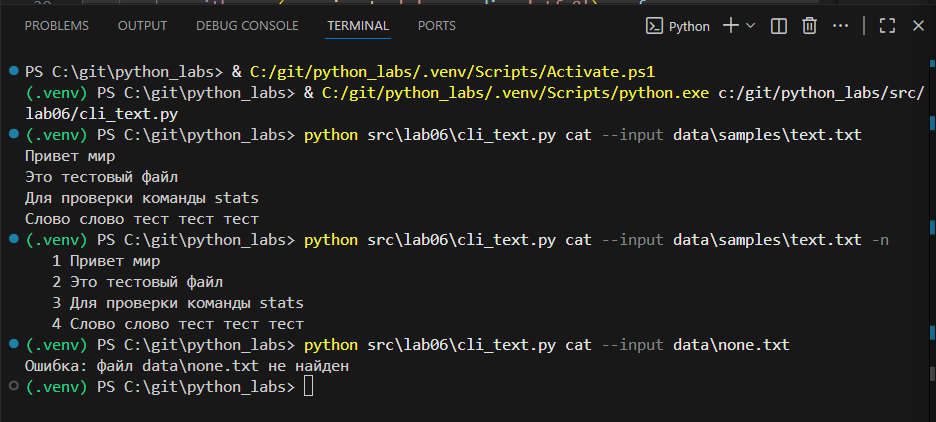
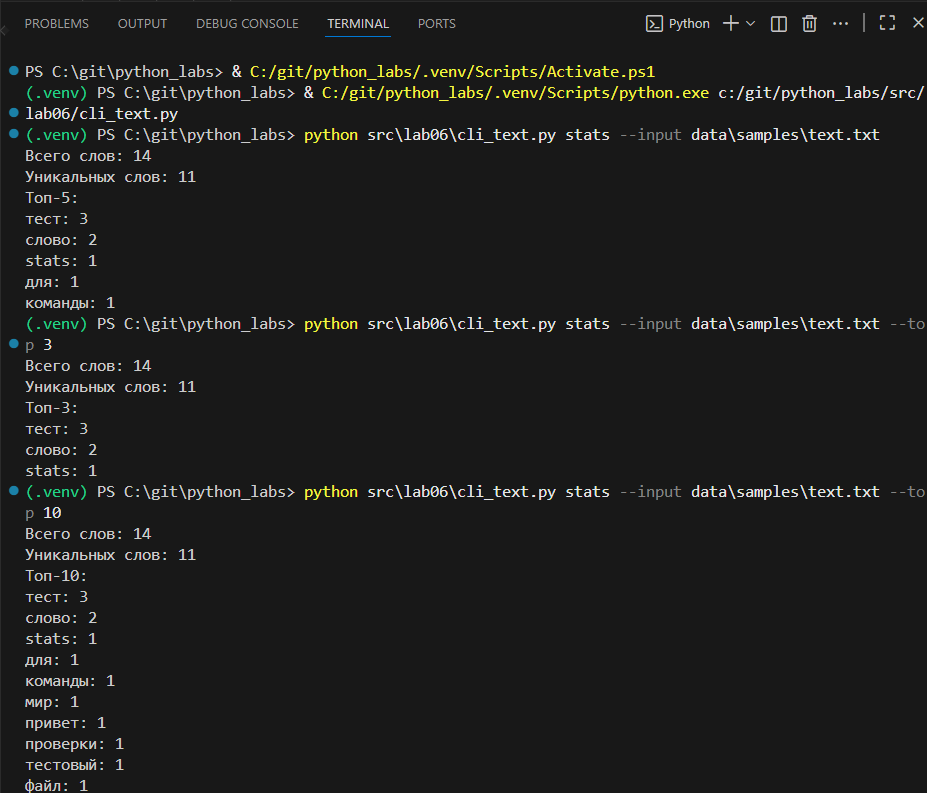

### Задание B
```python
import argparse
import sys
from pathlib import Path

sys.path.append(str(Path(__file__).parent.parent))

from lab05.json_csv import json_to_csv, csv_to_json
from lab05.csv_xlsx import csv_to_xlsx
def main():
    parser = argparse.ArgumentParser(description="Конвертеры данных")
    sub = parser.add_subparsers(dest="cmd")
    p1 = sub.add_parser("json2csv")
    p1.add_argument("--in", dest="input", required=True)
    p1.add_argument("--out", dest="output", required=True)
    p2 = sub.add_parser("csv2json")
    p2.add_argument("--in", dest="input", required=True)
    p2.add_argument("--out", dest="output", required=True)
    p3 = sub.add_parser("csv2xlsx")
    p3.add_argument("--in", dest="input", required=True)
    p3.add_argument("--out", dest="output", required=True)
    args = parser.parse_args()
    if args.cmd == "json2csv":
        json_to_csv(args.input, args.output)
        print(f"Успешно: {args.input} -> {args.output}")
    elif args.cmd == "csv2json":
        csv_to_json(args.input, args.output)
        print(f"Успешно: {args.input} -> {args.output}")
    elif args.cmd == "csv2xlsx":
        csv_to_xlsx(args.input, args.output)
        print(f"Успешно: {args.input} -> {args.output}")
    else:
        print("Ошибка: неизвестная команда")

if __name__ == "__main__":
    main()
```
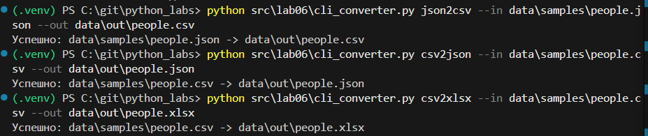

## Лабораторная работа 7
### Задание А
```python
import sys
import os
import pytest

sys.path.insert(0, os.path.join(os.path.dirname(__file__), ".."))

from src.lab03.text import normalize, tokenize, count_freq, top_n


class TestText:

    @pytest.mark.parametrize(
        "input_text, expected",
        [
            ("Hello world", "hello world"),
            (" PYTHON  Programming  ", "python programming"),
            ("Test123", "test123"),
            ("", ""),
            ("  ", ""),
            ("Hello!!??", "hello!!??"),
            ("Привет Мир", "привет мир"),
            ("café", "café"),
        ],
    )
    def test_normalize(self, input_text, expected):
        assert normalize(input_text) == expected

    @pytest.mark.parametrize(
        "input_text, expected",
        [
            ("Hello world", ["hello", "world"]),
            ("hello, world!", ["hello", "world"]),
            ("Привет мир", ["привет", "мир"]),
        ],
    )
    def test_tokenize(self, input_text, expected):
        assert tokenize(input_text) == expected

    @pytest.mark.parametrize(
        "tokens, expected",
        [
            (["hello", "world", "hello"], {"hello": 2, "world": 1}),
            ([], {}),
            (["a", "b", "a", "c", "c"], {"a": 2, "b": 1, "c": 2}),
        ],
    )
    def test_count_freq(self, tokens, expected):
        assert count_freq(tokens) == expected

    @pytest.mark.parametrize(
        "freq, n, expected",
        [
            ({"hello": 2, "world": 1}, 1, [("hello", 2)]),
            ({"a": 2, "b": 2, "c": 1}, 2, [("a", 2), ("b", 2)]),
            ({"x": 3, "y": 3, "z": 3}, 3, [("x", 3), ("y", 3), ("z", 3)]),
            ({}, 1, []),
        ],
    )
    def test_top_n(self, freq, n, expected):
        assert top_n(freq, n) == expected

```
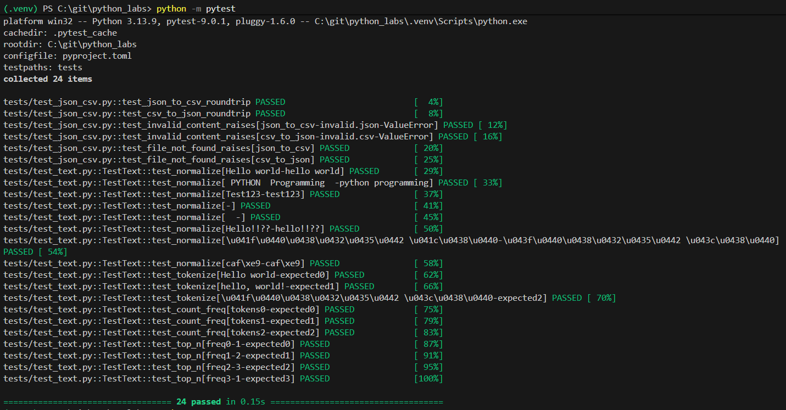
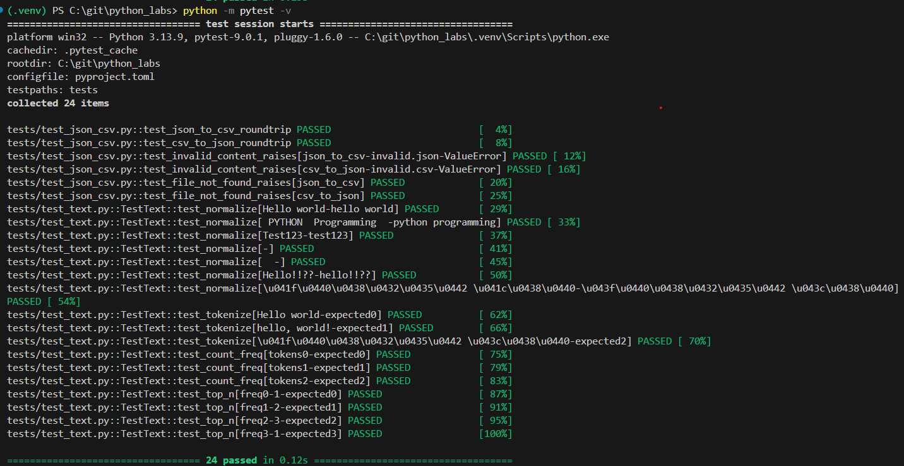

### Задание B
```python
import json
import csv
import pytest
from pathlib import Path
import sys
import os

sys.path.insert(0, os.path.join(os.path.dirname(__file__), ".."))

from src.lab05.json_csv import json_to_csv, csv_to_json


def test_json_to_csv_roundtrip(tmp_path: Path):
    src = tmp_path / "people.json"
    dst = tmp_path / "people.csv"
    data = [
        {"name": "Alice", "age": 22},
        {"name": "Bob", "age": 25},
    ]
    src.write_text(json.dumps(data, ensure_ascii=False, indent=2), encoding="utf-8")
    json_to_csv(str(src), str(dst))

    with dst.open(encoding="utf-8") as f:
        rows = list(csv.DictReader(f))
    assert len(rows) == len(data)
    assert {"name", "age"} <= set(rows[0].keys())


def test_csv_to_json_roundtrip(tmp_path: Path):
    src = tmp_path / "people.csv"
    dst = tmp_path / "people_out.json"
    rows = [
        {"name": "Alice", "age": "22"},
        {"name": "Bob", "age": "25"},
    ]
    with src.open("w", encoding="utf-8", newline="") as f:
        writer = csv.DictWriter(f, fieldnames=["name", "age"])
        writer.writeheader()
        writer.writerows(rows)

    csv_to_json(str(src), str(dst))

    data_out = json.loads(dst.read_text(encoding="utf-8"))

    assert len(data_out) == len(rows)
    assert all("name" in rec and "age" in rec for rec in data_out)


@pytest.mark.parametrize(
    "func, input_file, error",
    [
        ("json_to_csv", "invalid.json", ValueError),
        ("csv_to_json", "invalid.csv", ValueError),
    ],
)
def test_invalid_content_raises(func, input_file, error, tmp_path: Path):
    fpath = tmp_path / input_file
    fpath.write_text("this is not valid json or csv", encoding="utf-8")

    dst = tmp_path / "out.file"

    f = json_to_csv if func == "json_to_csv" else csv_to_json

    with pytest.raises(error):
        f(str(fpath), str(dst))


@pytest.mark.parametrize("func", [json_to_csv, csv_to_json])
def test_file_not_found_raises(func, tmp_path: Path):
    non_existent_path = tmp_path / "no_such_file.non"
    dst = tmp_path / "out.file"
    with pytest.raises(FileNotFoundError):
        func(str(non_existent_path), str(dst))
```
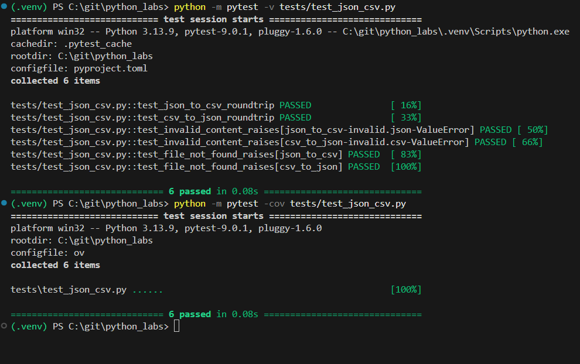

### Black
```toml
[tool.black]
line-length = 88
target-version = ['py39']
include = '\.pyi?$'
exclude = '''
/(
  \.eggs
  | \.git
  | \.hg
  | \.mypy_cache
  | \.tox
  | \.venv
  | build
  | dist
)/
'''

[tool.pytest.ini_options]
minversion = "6.0"
testpaths = ["tests"]
python_files = ["test_*.py", "*_test.py"]
python_functions = ["test_*"]
addopts = [
  "-v",
  "--tb=short"
]
markers = [
  "slow: mark test as slow",
  "integration: mark test as integration"
]
```
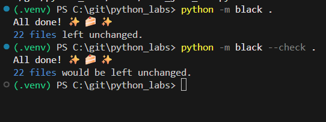


## Лабораторная работа 8
### Задание models
```python

from dataclasses import dataclass
from datetime import datetime, date

@dataclass #Декоратор генерирующий методы
class Student:
    fio: str
    birthdate: str
    group: str
    gpa: float
    
    def __post_init__(self):
        try:
            datetime.strptime(self.birthdate, "%Y-%m-%d")
        except ValueError:
            raise ValueError(
                f"Неверный формат даты: {self.birthdate}. "
                f"Ожидается YYYY-MM-DD"
            )
        
        if not (0 <= self.gpa <= 5):
            raise ValueError(
                f"Средний балл должен быть от 0 до 5. Получено: {self.gpa}"
            )
        
        birth_date = datetime.strptime(self.birthdate, "%Y-%m-%d").date()
        if birth_date > date.today():
            raise ValueError(
                f"Дата рождения не может быть в будущем: {self.birthdate}"
            )
    
    def age(self) -> int:
        birth_date = datetime.strptime(self.birthdate, "%Y-%m-%d").date()
        today = date.today()
        
        age = today.year - birth_date.year
        
        if (today.month, today.day) < (birth_date.month, birth_date.day):
            age -= 1
        return age
    
    def to_dict(self) -> dict:
        return {
            "fio": self.fio,
            "birthdate": self.birthdate,
            "group": self.group,
            "gpa": self.gpa,
            "age": self.age()
        }
    
    @classmethod
    def from_dict(cls, data: dict) -> "Student":
        required_fields = ["fio", "birthdate", "group", "gpa"]
        for field in required_fields:
            if field not in data:
                raise ValueError(f"Отсутствует обязательное поле: {field}")
        
        return cls(
            fio=data["fio"],
            birthdate=data["birthdate"],
            group=data["group"],
            gpa=data["gpa"]
        )
    
    def __str__(self) -> str:#Метод для строкового представления объекта(print())
        return (
            f"Студент: {self.fio}\n"
            f"Дата рождения: {self.birthdate} (возраст: {self.age()})\n"
            f"Группа: {self.group}\n"
            f"Средний балл: {self.gpa:.2f}")

```
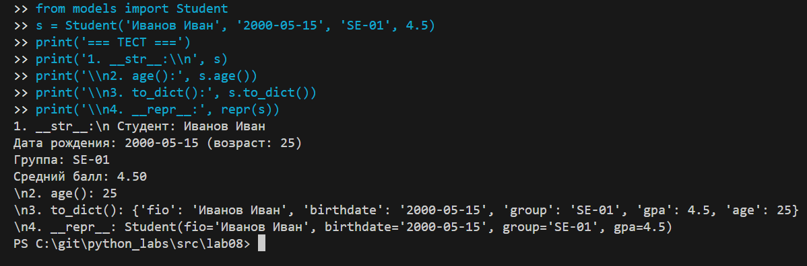
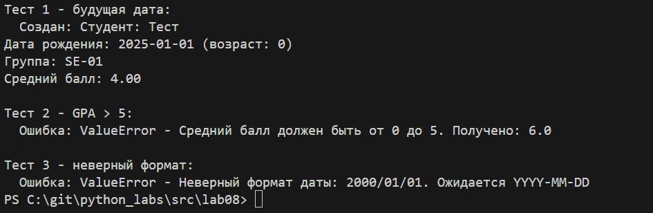

### Задание serialize
```python
import json
from pathlib import Path
from typing import List
from models import Student


def students_to_json(students: List[Student], path: str) -> None:
    if not isinstance(students, list):
        raise TypeError("Ожидается список студентов")

    if not students:
        raise ValueError("Список студентов пуст")
    
    data = [student.to_dict() for student in students]
    
    Path(path).parent.mkdir(parents=True, exist_ok=True)
    
    with open(path, 'w', encoding='utf-8') as f:
        json.dump(data, f, ensure_ascii=False, indent=2, default=str)
    
    print(f"Сохранено {len(students)} студентов в {path}")


def students_from_json(path: str) -> List[Student]:
    if not Path(path).exists():
        raise FileNotFoundError(f"Файл не найден: {path}")

    with open(path, 'r', encoding='utf-8') as f:
        data = json.load(f)
    
    if not isinstance(data, list):
        raise ValueError("JSON должен содержать массив объектов")
    
    students = []
    errors = []
    
    for i, item in enumerate(data, 1):
        try:
            student = Student.from_dict(item)
            students.append(student)
        except ValueError as e:
            errors.append(f"Строка {i}: {e}")
    
    if errors:
        print("Обнаружены ошибки при загрузке:")
        for error in errors:
            print(f"  - {error}")
    
    print(f"Загружено {len(students)} студентов из {path}")
    return students

```
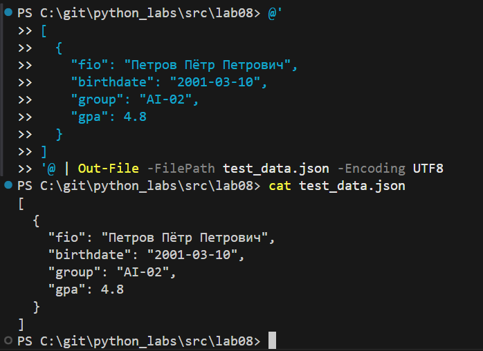
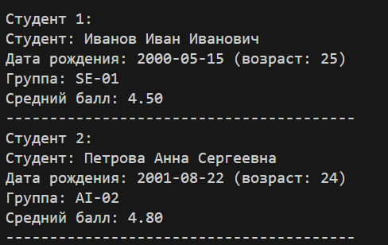


## Лабораторная работа 9
```python

import csv
from pathlib import Path
from typing import List, Dict, Any
import sys
import os

sys.path.append(os.path.join(os.path.dirname(__file__), '../..'))
from src.lab08.models import Student

class Group: #инициализирует объект группы студентов
    def __init__(self, storage_path: str):
        self.path = Path("data/lab09") / storage_path # Создаем полный путь к файлу в data/lab09
        self._ensure_storage_exists() # Гарантируем, что файл хранилища существует (создаем если нет)
    
    def _ensure_storage_exists(self):# Внутренний метод для создания файла хранилища при его отсутствии
        self.path.parent.mkdir(parents=True, exist_ok=True) # Создаем папку data/lab09 если её нет
        
        if not self.path.exists():
            with open(self.path, 'w', encoding='utf-8', newline='') as f:
                writer = csv.DictWriter(f, fieldnames=['fio', 'birthdate', 'group', 'gpa'])
                writer.writeheader()
    
    def _read_all(self) -> List[Dict[str, Any]]: # Прочитать все строки из CSV
        rows = []
        with open(self.path, 'r', encoding='utf-8') as f:
            reader = csv.DictReader(f)
            for row in reader:
                row['gpa'] = float(row['gpa'])
                rows.append(row)
        return rows
    
    def _write_all(self, rows: List[Dict[str, Any]]): # Записать все строки в CSV
        with open(self.path, 'w', encoding='utf-8', newline='') as f:
            writer = csv.DictWriter(f, fieldnames=['fio', 'birthdate', 'group', 'gpa'])
            writer.writeheader()
            writer.writerows(rows)
    
    def list(self) -> List[Student]: # Вернуть всех студентов в виде списка Student
        rows = self._read_all()
        students = []
        for row in rows:
            try:
                student = Student.from_dict(row)
                students.append(student)
            except ValueError as e:
                print(f"Ошибка валидации студента {row['fio']}: {e}")
        return students
    
    def add(self, student: Student): # Добавить нового студента в CSV
        try:
            validated_student = Student(
                fio=student.fio,
                birthdate=student.birthdate,
                group=student.group,
                gpa=student.gpa
            )
        except ValueError as e:
            raise ValueError(f"Некорректные данные студента: {e}")
        
        # СОЗДАЁМ СЛОВАРЬ ТОЛЬКО С НУЖНЫМИ ДЛЯ CSV ПОЛЯМИ
        student_dict = {
            'fio': validated_student.fio,
            'birthdate': validated_student.birthdate,
            'group': validated_student.group,
            'gpa': validated_student.gpa
        }
        
        with open(self.path, 'a', encoding='utf-8', newline='') as f:
            writer = csv.DictWriter(f, fieldnames=['fio', 'birthdate', 'group', 'gpa'])
            writer.writerow(student_dict)  # ← Теперь передаём правильный словарь
    
    def find(self, substr: str) -> List[Student]: # Найти студентов по подстроке в fio
        students = self.list()
        return [student for student in students if substr.lower() in student.fio.lower()]
    
    def remove(self, fio: str): # Удалить запись(и) с данным fio
        rows = self._read_all()
        updated_rows = [row for row in rows if row['fio'] != fio]
        
        if len(updated_rows) == len(rows):
            raise ValueError(f"Студент с ФИО '{fio}' не найден")
        
        self._write_all(updated_rows)
    
    def update(self, fio: str, **fields): # Обновить поля существующего студента
        rows = self._read_all()
        updated = False
        
        for row in rows:
            if row['fio'] == fio:
                for field, value in fields.items():
                    if field in ['fio', 'birthdate', 'group', 'gpa']:
                        row[field] = value
                updated = True
                try:
                    Student.from_dict(row)
                except ValueError as e:
                    raise ValueError(f"Некорректные данные после обновления: {e}")
        
        if not updated:
            raise ValueError(f"Студент с ФИО '{fio}' не найден")
        
        self._write_all(rows)
    
    def stats(self) -> Dict[str, Any]: # Статистика по группе
        students = self.list()
        
        if not students:
            return {
                "count": 0,
                "min_gpa": 0,
                "max_gpa": 0,
                "avg_gpa": 0,
                "groups": {},
                "top_5_students": []
            }
        
        gpas = [student.gpa for student in students]
        groups_stats = {}
        for student in students:
            groups_stats[student.group] = groups_stats.get(student.group, 0) + 1
        
        sorted_students = sorted(students, key=lambda s: s.gpa, reverse=True)
        top_5 = [{"fio": s.fio, "gpa": s.gpa} for s in sorted_students[:5]]
        
        return {
            "count": len(students),
            "min_gpa": min(gpas),
            "max_gpa": max(gpas),
            "avg_gpa": round(sum(gpas) / len(gpas), 2),
            "groups": groups_stats,
            "top_5_students": top_5
        }
    
    def exists(self, fio: str) -> bool: # Проверить существует ли студент с таким ФИО
        students = self.list()
        return any(student.fio == fio for student in students)

    def is_empty(self) -> bool: # Проверить пуст ли файл (только заголовок)
        with open(self.path, 'r', encoding='utf-8') as f:
            reader = csv.DictReader(f)
            return len(list(reader)) == 0
    
if __name__ == "__main__":
    group = Group("students.csv")
    print(f"Путь к файлу: {group.path}")  # ← добавь эту строку
    print(f"Файл существует: {group.path.exists()}")
    if group.is_empty():
        students_to_add = [
            Student("Иванов Иван", "2000-05-15", "БИВТ-21-1", 4.5),
            Student("Петрова Анна", "2001-12-03", "БИВТ-21-2", 3.8),
            Student("Сидоров Алексей", "1999-08-22", "БИВТ-21-1", 4.2),
            Student("Козлова Мария", "2002-03-10", "БИВТ-21-3", 4.8),
            Student("Новиков Дмитрий", "2000-11-25", "БИВТ-21-2", 3.5),
            Student("Иванова Ольга", "2001-07-14", "БИВТ-21-1", 4.9)
        ]
        
        for student in students_to_add:
            group.add(student)
            print(f"    Добавлен: {student.fio}")
    else:
        print("Файл уже содержит данные")
    
    # Тестируем методы
    print("\n=== Все студенты ===")
    for student in group.list():
        print(f"  {student}")
    
    print("\n=== Поиск по 'Иванов' ===")
    for student in group.find("Иванов"):
        print(f"  {student}")
    
    print("\n=== Статистика ===")
    stats = group.stats()
    print(f"  Всего студентов: {stats['count']}")
    print(f"  Минимальный GPA: {stats['min_gpa']}")
    print(f"  Максимальный GPA: {stats['max_gpa']}")
    print(f"  Средний GPA: {stats['avg_gpa']}")
    print(f"  Распределение по группам: {stats['groups']}")
    print(f"  Топ-5 студентов:")
    for student in stats['top_5_students']:
        print(f"    {student['fio']} - GPA: {student['gpa']}")
group.remove("Новиков Дмитрий")
print(f"\nПосле удаления Новикова, всего студентов: {len(group.list())}")

```


