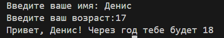
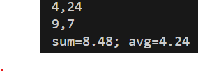
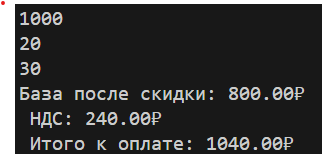
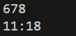
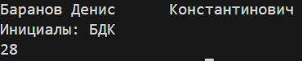
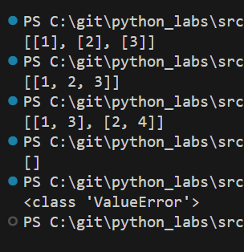
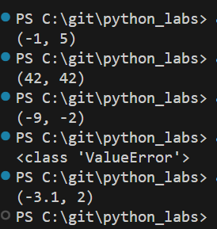

# python_labs
## Лабораторная работа 1

### Задание 1
```python
name = input('Введите ваше имя: ')
age = int(input('Введите ваш возраст:'))
print(f"Привет, {name}! Через год тебе будет {age+1}")
```


### Задание 2
```python
a = input()
a2 = float(a.replace(',','.'))
b = input()
b2 = float(a.replace(',','.'))
print(f'sum={a2+b2:.2f}; avg={((a2+b2)/2):.2f}')
```


### Задание 3
```python
price = float(input())
discont = float(input())
vat = float(input())
base = price * (1 - (discont/100))
vat_amount = base * (vat/100)
total = base + vat_amount
print(f'База после скидки: {base:.2f}₽ \n НДС: {vat_amount:.2f}₽ \n Итого к оплате: {total:.2f}₽')
```


### Задание 4
```python
m = int(input())
print(f'{m//60}:{m%60}')
```


### Задание 5
```python
name = input()
name2 = name.split()
print(f'Инициалы: {name2[0][0]+name2[1][0]+name2[2][0]}')
print(len(name2[0]) + len(name2[1]) + len(name2[2]) + 2)
```


# python_labs
## Лабораторная работа 2

### Задание 1
```python
def min_max(arr):
    if len(arr) == 0:
        return ValueError
    else:
        k = 0
        k2 = float('inf')
        for i in arr:
            if i >= k:
                k = i
            if i < k2:
                k2 = i
        return(k2,k)
#print(min_max([]))

def unique_sorted(arr):
    if len(arr) == 0:
        return arr
    else:
        arr2 = []
        for i in range(len(arr)-1):
            for j in range(i+1,len(arr)):
                if arr[i] > arr[j]:
                    a = arr[i]
                    arr[i] = arr[j]
                    arr[j] = a
        for i in arr:
            if arr.count(i) == 1:
                arr2.append(i)
            elif arr.count(i) != 1 and arr2.count(i) == 0:
                arr2.append(i)
        return arr2
#print(unique_sorted([1.0,1,2.5,2.5,0]))

def flatten(arr):
    arr2 = []
    for i in arr:
        for j in i:
            if type(j) != str:
                arr2.append(j)
            else:
                return TypeError
    return arr2
#print(flatten([[1, 2], "ab"]))
```


```python
name = input('Введите ваше имя: ')
age = int(input('Введите ваш возраст:'))
print(f"Привет, {name}! Через год тебе будет {age+1}")
```


### Задание 2
```python
a = input()
a2 = float(a.replace(',','.'))
b = input()
b2 = float(a.replace(',','.'))
print(f'sum={a2+b2:.2f}; avg={((a2+b2)/2):.2f}')
```


### Задание 3
```python
price = float(input())
discont = float(input())
vat = float(input())
base = price * (1 - (discont/100))
vat_amount = base * (vat/100)
total = base + vat_amount
print(f'База после скидки: {base:.2f}₽ \n НДС: {vat_amount:.2f}₽ \n Итого к оплате: {total:.2f}₽')
```


### Задание 4
```python
m = int(input())
print(f'{m//60}:{m%60}')
```


### Задание 5
```python
name = input()
name2 = name.split()
print(f'Инициалы: {name2[0][0]+name2[1][0]+name2[2][0]}')
print(len(name2[0]) + len(name2[1]) + len(name2[2]) + 2)
```


# python_labs
## Лабораторная работа 2

### Задание 1.1
```python
def min_max(arr):
    if len(arr) == 0:
        return ValueError
    else:
        k = 0
        k2 = float('inf')
        for i in arr:
            if i >= k:
                k = i
            if i < k2:
                k2 = i
        return(k2,k)
#print(min_max([]))
```



